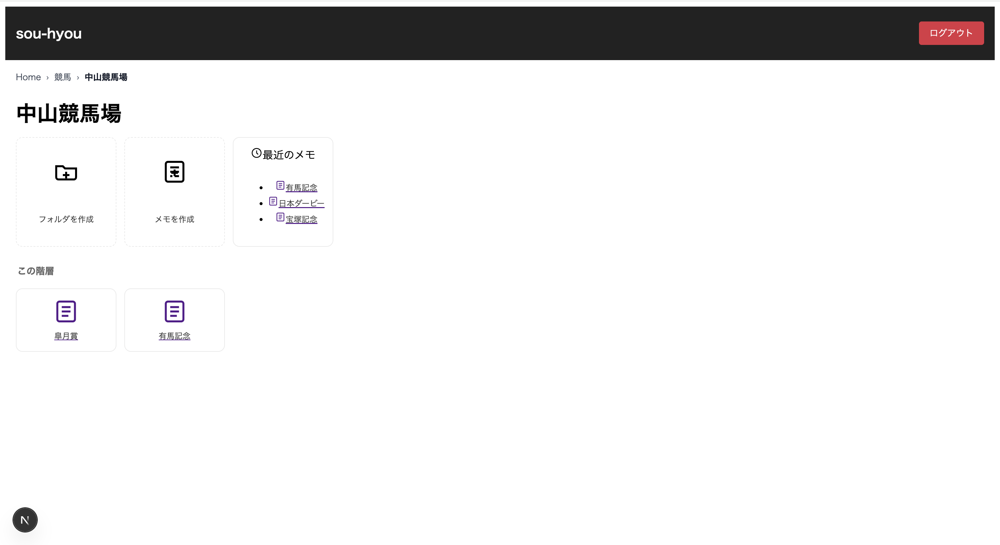
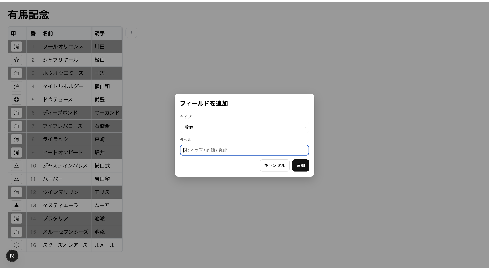
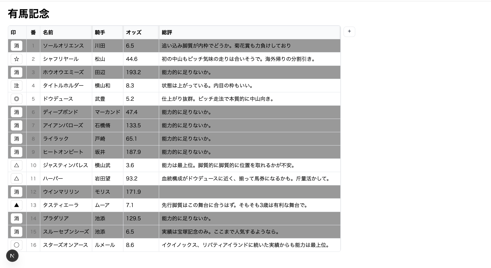

## sou-hyou
フォルダ階層でレースメモを整理し、**出馬表を自分好みのテーブルで編集**できるアプリ。

印（◎◯▲△☆注・消）は **クリックで循環 / 長押しでメニュー**、カラムは **ドラッグで横幅調整** など、操作感にこだわっています。

現在開発中...

## 技術スタック
**Web**: Next.js (App Router), React 19, Apollo Client, TypeScript, pnpm

**Server**: Express, Apollo Server, GraphQL, Mongoose

**Auth**: Firebase Authentication

**DB**: MongoDB

## スクリーンショット
まだ開発中ですがアプリの雰囲気はこんな感じ

## 今後の実装予定
- パスツリーのあるサイドバー
- 実際のレースを選択し、馬名や騎手などのフィールドを自動で補完
- テーブルのテンプレート作成機能
- 馬名で検索し、過去の予想から該当するフィールドを一覧表示